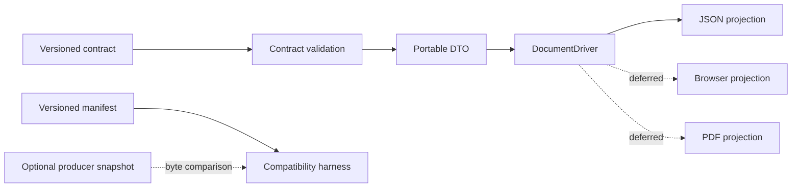

# x-document Architecture

## Context

x-document consumes a validated, presentation-neutral resolved-document contract. The producer owns business meaning. x-document owns projection through independent drivers.

## Contract boundary

Schemas under `resources/contracts/x-document/1.0/` are the reviewed contract copied from GNE commit `9d90ecb25326989a5aee1f6305fb9deaede94b7e`. Stable schema IDs resolve through `ContractSchemaRegistry`. Validation rejects unknown versions and malformed requests without coercion.

The DTO layer exposes request identity and resolved-document identity while retaining the validated portable payload. It contains no callback into GNE and no repository lookup address. Source references remain opaque provenance.

## Compatibility boundary

`manifest.json` is the deterministic inventory of contract `1.0` schemas and fixtures. It records stable schema IDs and exact SHA-256 checksums. `VerifyContractCompatibility` verifies installed bytes, schema IDs, registry coverage, fixture schema validity, canonical fixture serialization, duplicate declarations, and orphaned assets. It reports drift but never repairs it.

An optional snapshot is a package-shaped directory containing the manifest and every package-relative file it declares. Snapshot comparison is byte-exact. The absence of a snapshot is reported as `not_supplied` and does not weaken or fail local integrity checks. This development/CI path never runs from a document driver and creates no runtime dependency on GNE.

## Driver boundary

`DocumentDriver` exposes a stable name, deterministic capability list, and `compile()` operation. The JSON driver supports `actions`, `attachments`, and `evidence`, exactly matching the request vocabulary closed in contract `1.0`. It emits the complete request as canonical inline JSON, calculates its checksum and byte length from the final bytes, constructs a valid result state through named factories, and validates that result against the installed result schema. `BrowserDocumentDriver` and `PdfDocumentDriver` define future boundaries only; neither has an implementation.

Drivers do not select artifacts, interpret evidence, determine readiness, or execute actions. Each future driver must remain independently implementable.

## Result and output invariants

`DocumentCompilationStatus` distinguishes `succeeded`, `unsupported`, and `failed`. A succeeded factory requires `DocumentOutput`; unsupported and failed factories cannot carry output. `DocumentOutput::inline()` derives its checksum and byte length, while `referenced()` enforces the closed contract's safe-reference and checksum forms. Private constructors prevent ordinary callers from creating mixed content modes or invalid status/output combinations.

The request fingerprint identifies producer input. For the JSON reference driver, the output checksum is the output identity: it hashes the exact canonical bytes and needs no additional contract field. Object keys are recursively sorted; list order and all document semantics are preserved.

## Failure principles

Malformed input and unsupported versions fail before driver invocation. A valid request targeted to another driver or asking for an unsupported capability returns an `unsupported` result with safe deterministic details. A future expected operational failure may use `failed`; the JSON driver currently has no such failure. Result-schema violations and unexpected serialization or implementation defects propagate. No broad catch converts defects into normal outcomes.

## Dependency direction

The package depends on PHP and Opis JSON Schema. Pest, Pint, and PHPStan are development tools. It has no GNE, Eloquent, HTTP, Vue, Inertia, x-change, storage, queue, or rendering dependency.
