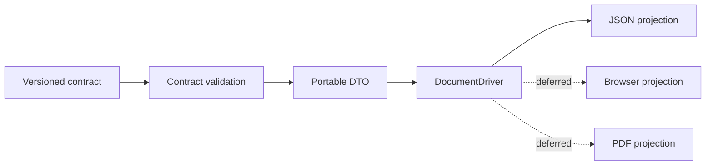

# x-document Architecture

## Context

x-document consumes a validated, presentation-neutral resolved-document contract. The producer owns business meaning. x-document owns projection through independent drivers.

## Contract boundary

Schemas under `resources/contracts/x-document/1.0/` are the reviewed contract copied from GNE commit `9d90ecb25326989a5aee1f6305fb9deaede94b7e`. Stable schema IDs resolve through `ContractSchemaRegistry`. Validation rejects unknown versions and malformed requests without coercion.

The DTO layer exposes request identity and resolved-document identity while retaining the validated portable payload. It contains no callback into GNE and no repository lookup address. Source references remain opaque provenance.

## Driver boundary

`DocumentDriver` has only a stable name and `compile()` operation. The JSON driver proves the boundary by returning canonical request JSON in a schema-valid result. `BrowserDocumentDriver` and `PdfDocumentDriver` define future boundaries only; neither has an implementation.

Drivers do not select artifacts, interpret evidence, determine readiness, or execute actions. Each future driver must remain independently implementable.

## Failure principles

Malformed input and unsupported versions fail before driver invocation. Drivers receive only validated `DocumentCompilationRequest` objects. No failure is silently normalized into different meaning.

## Dependency direction

The package depends on PHP and Opis JSON Schema. Pest, Pint, and PHPStan are development tools. It has no GNE, Eloquent, HTTP, Vue, Inertia, x-change, storage, queue, or rendering dependency.
