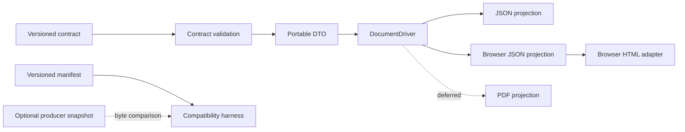

# x-document Architecture

## Context

x-document consumes a validated, presentation-neutral resolved-document contract. The producer owns business meaning. x-document owns projection through independent drivers.

## Contract boundary

Schemas under `resources/contracts/x-document/1.0/` are the reviewed contract copied from GNE commit `9d90ecb25326989a5aee1f6305fb9deaede94b7e`. Stable schema IDs resolve through `ContractSchemaRegistry`. Validation rejects unknown versions and malformed requests without coercion.

The DTO layer exposes request identity and resolved-document identity while retaining the validated portable payload. It contains no callback into GNE and no repository lookup address. Source references remain opaque provenance.

## Compatibility boundary

`manifest.json` is the deterministic inventory of contract `1.0` schemas and fixtures. It records stable schema IDs and exact SHA-256 checksums. `VerifyContractCompatibility` verifies installed bytes, schema IDs, registry coverage, fixture schema validity, canonical fixture serialization, duplicate declarations, and orphaned assets. It reports drift but never repairs it.

An optional snapshot is a package-shaped directory containing the manifest and every package-relative file it declares. Snapshot comparison is byte-exact. The absence of a snapshot is reported as `not_supplied` and does not weaken or fail local integrity checks. This development/CI path never runs from a document driver and creates no runtime dependency on GNE.

## Driver boundary

`DocumentDriver` exposes a stable name, deterministic capability list, and `compile()` operation. The JSON driver supports `actions`, `attachments`, and `evidence`, exactly matching the request vocabulary closed in contract `1.0`. It emits the complete request as canonical inline JSON, calculates its checksum and byte length from the final bytes, constructs a valid result state through named factories, and validates that result against the installed result schema.

The concrete browser driver is an independent peer. `BuildBrowserProjection` mechanically maps one validated request to format `browser/1.0`; it preserves source order, normalized values, subject identity, evidence links, actions, and attachment metadata. It assigns deterministic section, field, evidence, action, attachment, and projection identities, validates the projection schema, emits canonical inline vendor JSON, and validates the compilation result. Its projection is read-only and contains no frontend, HTML, repository, or action-execution behavior. The PDF boundary remains interface-only.

Drivers do not select artifacts, interpret evidence, determine readiness, or execute actions. Each future driver must remain independently implementable.

## Result and output invariants

`DocumentCompilationStatus` distinguishes `succeeded`, `unsupported`, and `failed`. A succeeded factory requires `DocumentOutput`; unsupported and failed factories cannot carry output. `DocumentOutput::inline()` derives its checksum and byte length, while `referenced()` enforces the closed contract's safe-reference and checksum forms. Private constructors prevent ordinary callers from creating mixed content modes or invalid status/output combinations.

The request fingerprint identifies producer input. For the JSON reference driver, the output checksum is the output identity: it hashes the exact canonical bytes and needs no additional contract field. Object keys are recursively sorted; list order and all document semantics are preserved.

The browser projection has a separate format identity and manifest under `resources/projections/browser/1.0/`; these assets are x-document-owned and are deliberately absent from the GNE contract manifest. Its output checksum identifies the exact projection bytes, while the projection identifier derives from the request fingerprint, driver name, and projection format.

## HTML adapter boundary

`BrowserHtmlProjectionAdapter` accepts only a validated `BrowserProjection`. It never sees `DocumentCompilationRequest`, `ResolvedDocument`, or a repository. It maps the existing section, field, subject, action, attachment, and evidence structures into complete semantic HTML format `browser-html/1.0`; it does not perform another semantic compilation.

Serialization uses fixed indentation, LF line endings, stable source order, fixed attribute order, UTF-8, and a final newline. Projection validation rejects malformed UTF-8 before adaptation; every accepted value entering text or an attribute then passes through `htmlspecialchars()` with `ENT_QUOTES | ENT_SUBSTITUTE | ENT_HTML5` as defense in depth. There is no raw-HTML input or sanitizer because markup is never accepted. The language is conservatively fixed to `en`; no locale is inferred.

The adapter emits one `<main>`, logical headings, definition lists for fields and lists for inert actions, attachment metadata, and evidence provenance. It adds structural class hooks but no stylesheet. Source references are neither linked nor rendered. `DocumentOutput::inline()` derives the exact HTML checksum and byte length. Its x-document-owned manifest lives under `resources/projections/browser-html/1.0/` and is not part of producer contract compatibility.

## Failure principles

Malformed input and unsupported versions fail before driver invocation. A valid request targeted to another driver or asking for an unsupported capability returns an `unsupported` result with safe deterministic details. A future expected operational failure may use `failed`; the JSON driver currently has no such failure. Result-schema violations and unexpected serialization or implementation defects propagate. No broad catch converts defects into normal outcomes.

## Dependency direction

The package depends on PHP and Opis JSON Schema. Pest, Pint, and PHPStan are development tools. It has no GNE, Eloquent, HTTP, Vue, React, Inertia, template engine, x-change, storage, queue, or network dependency.
